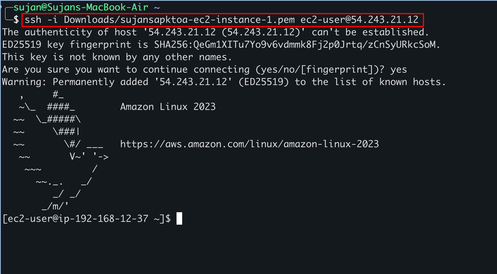
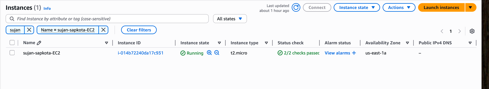
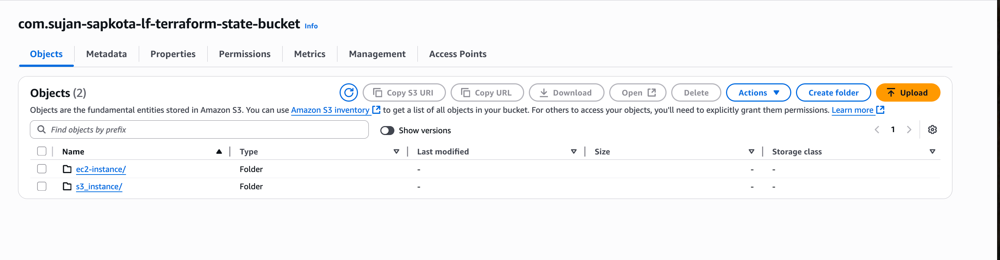

> ## Create two terraform projects with different backends:
    >  ## - Launch an EC2 instance
    > ## - Launch an S3 bucket. Using terraform_remote_state, get the arn of the EC2 instance from another project and add a policy in S3 bucket such that only that particular EC2 instance can write files to that bucket.


the code for the assignment can be accessed at: [code](code/)

what i did here is, created two separate directories for the two projects, one for the EC2 instance and another for the S3 bucket. The EC2 instance project uses an AWS backend, while the S3 bucket project uses a different backend. The S3 bucket project retrieves the EC2 instance ARN using `terraform_remote_state` and applies a policy to restrict write access to that specific EC2 instance.


for this, i ran backend_setup at the beginning to set up the backend for both projects. The backend setup creates an S3 bucket for storing Terraform state files and enables versioning on that bucket.

```
terraform {
    required_providers {
        aws = {
        source  = "hashicorp/aws"
        }
    }
    
}

provider "aws" {
  region = "us-east-1"  
}

resource "aws_s3_bucket" "terraform_state_bucket" {
  bucket = "com.sujan-sapkota-lf-terraform-state-bucket"
   object_lock_enabled = true

  tags = {
    Name = "terraform state bucket"
    Creator = "Sujan Sapkota"
  }
  
}

resource "aws_s3_bucket_versioning" "bucket_versioning_sujan-lf" {
  bucket = aws_s3_bucket.terraform_state_bucket.id
  versioning_configuration {
    status = "Enabled"
  }
}
``` 

i created two projects named `ec2-instance` and `s3-bucket`. The `ec2-instance` project contains the Terraform configuration to launch an EC2 instance, while the `s3-bucket` project contains the configuration to create an S3 bucket and apply a policy that allows only the specified EC2 instance to write to it.

the file structure is as follows:

```
code/
├── backend_setup/
│   └── main.tf
├── ec2_instance/
│   └── main.tf
└── s3-bucket/  
    └── main.tf
```

in the `ec2-instance/main.tf` file, i defined the EC2 instance resource and set up the backend to use the S3 bucket created in the `backend_setup` project. In the `s3-bucket/main.tf` file, i used `terraform_remote_state` to retrieve the EC2 instance ARN from the `ec2-instance` project and applied a policy to restrict write access to that specific EC2 instance.


i used the `terraform_remote_state` data source to access the outputs of the `ec2-instance` project. This allows me to retrieve the ARN of the EC2 instance created in that project and use it in the S3 bucket policy. i then used ssh to run the Terraform commands in each project directory. it connected to the EC2 instance and executed the Terraform commands to apply the configurations.





> ## Github actions workflow:
> - Write github workflows that satisfies all requirements in slide #8. Follow guidelines in slides #9 - #13